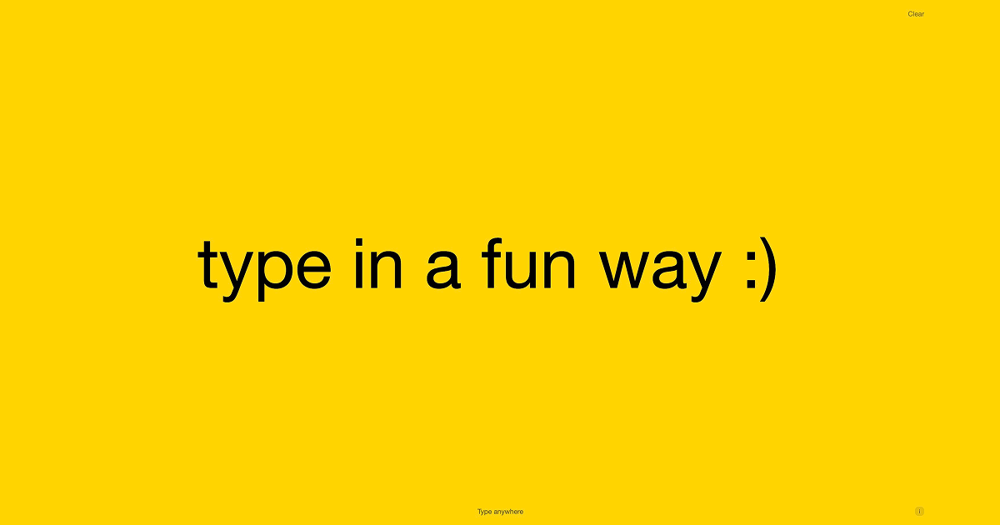

# TypeType

A playful single-page typing experience where every keypress reshapes the composition and cycles the background color.

Live site: [https://www.typetype.online/](https://www.typetype.online/)

## Preview



## Logo


## Features

- Full-screen typing canvas with automatic focus.
- Responsive text fitting to viewport size.
- Wrap behavior that adapts between single-line, manual line breaks, and auto-wrap.
- Background color cycling as text changes.
- Minimal UI with clear action and credits panel.
- GA4 tracking via `gtag.js`.

## Tech

- HTML
- Tailwind CSS (CDN)
- Vanilla JavaScript
- Vercel (deployment)

## Local development

This project is static and does not require a build step.

```bash
python3 -m http.server 8080
```

Then open [http://localhost:8080](http://localhost:8080).

## Deployment

Deploy on Vercel and connect `typetype.online` / `www.typetype.online` in your project domain settings.

